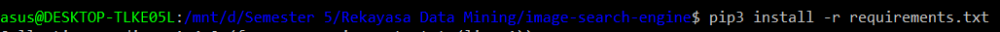

# Project-Indexing-RDM

## Image-search-engine
### 1. Requirements :

 install python3

### 2. Cara Menjalankan Program :
1.   Masuk ke direktori image-search-engine

2.   install requirement

3.   masuk ke direktori app

4.   python index.py --dataset static/images --index index.csv 

5. Untuk melihat output dapat dari index.cvs

6. gambar dapat di ganti di folder ./static/images

## Text-indexing
### 1. Requirements :

 install swish-e

### 2. Cara Menjalankan Program :
1. buat folder text-indexing dan masuk ke direktori text-indexing

2. buat folder file
3. masukan file yang akan diindex ke dalam folder file
4. buat file main.conf
5. jalankan $ swish-e -c main.conf 

6.Index kata yang diinginkan 

